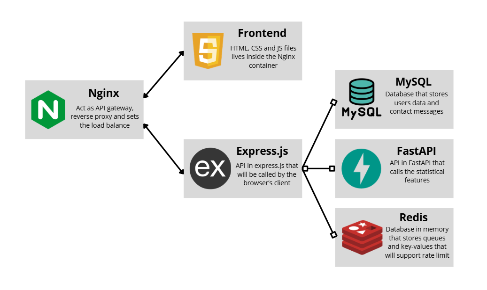
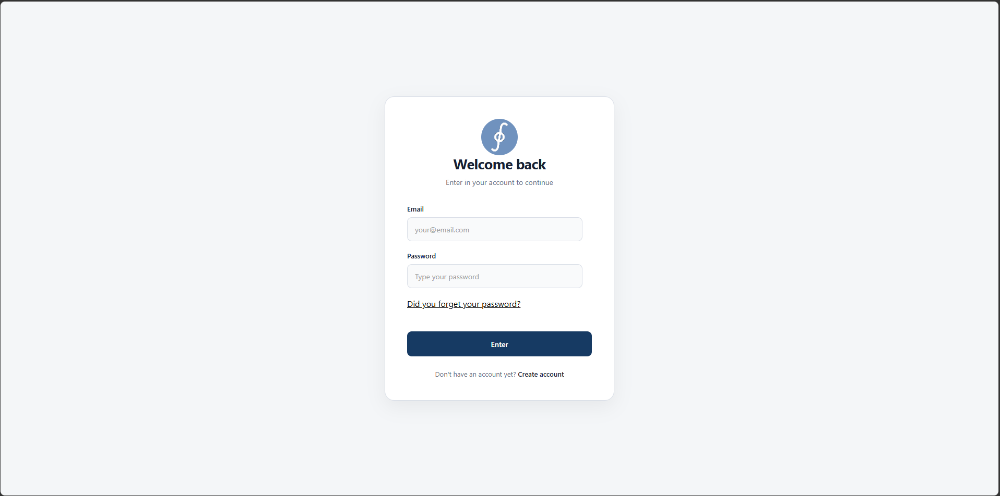
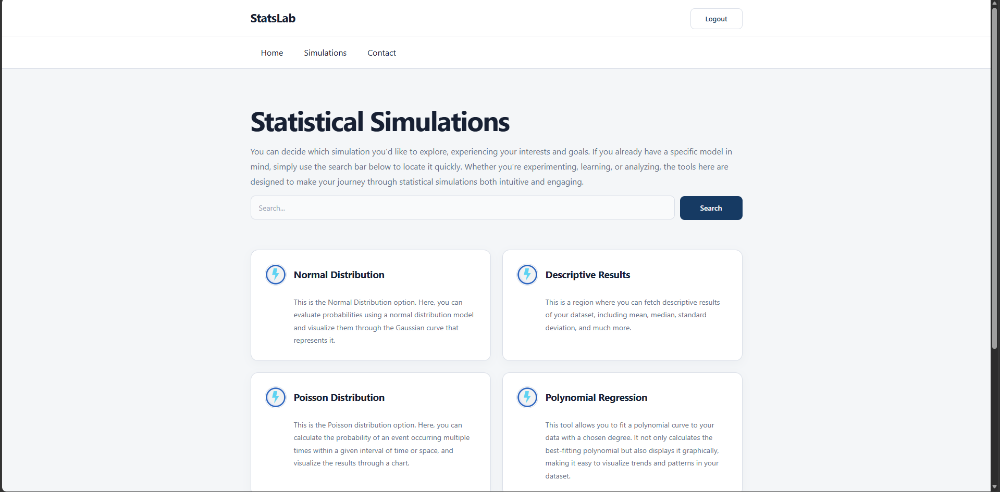
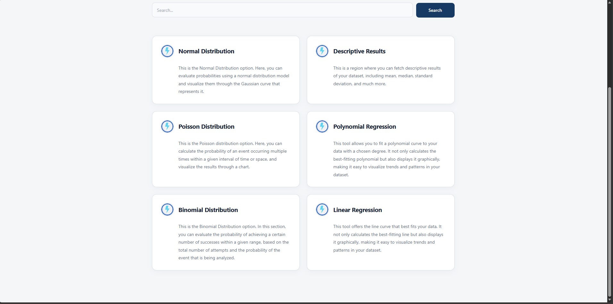
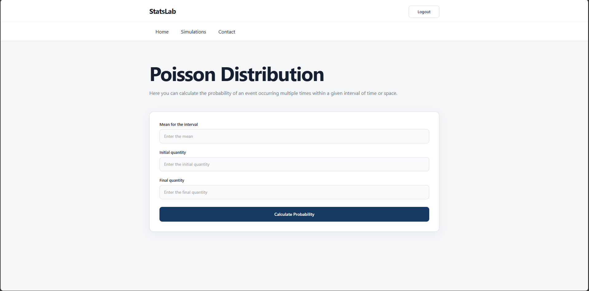
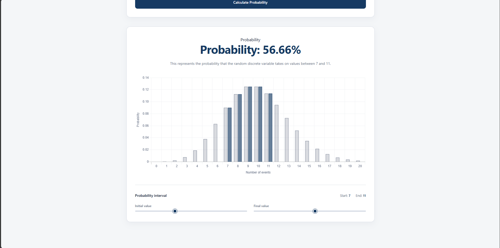
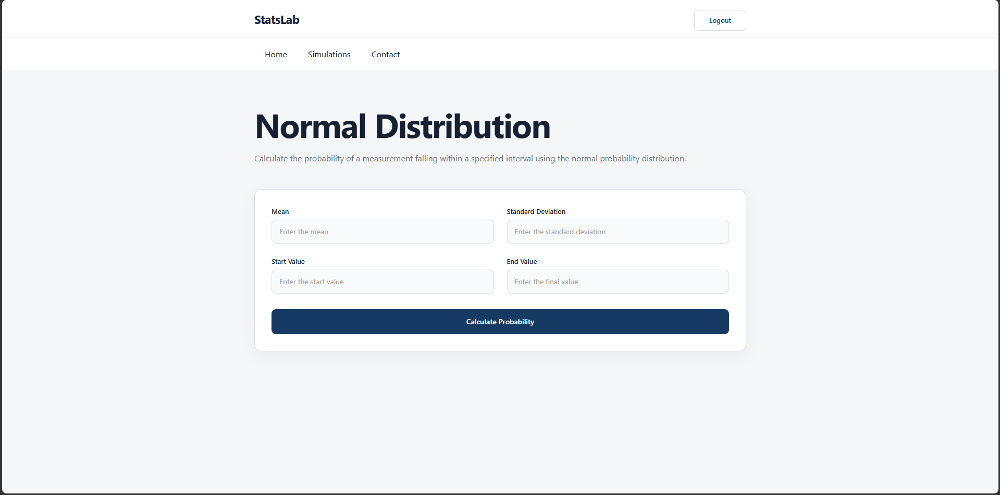
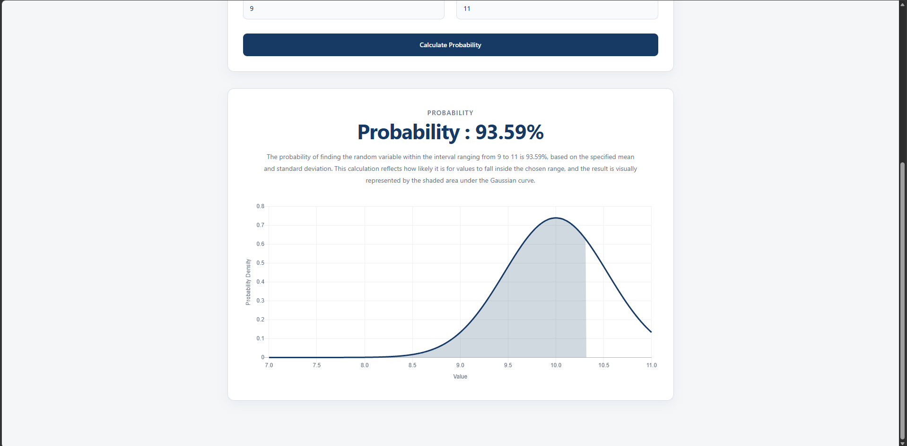
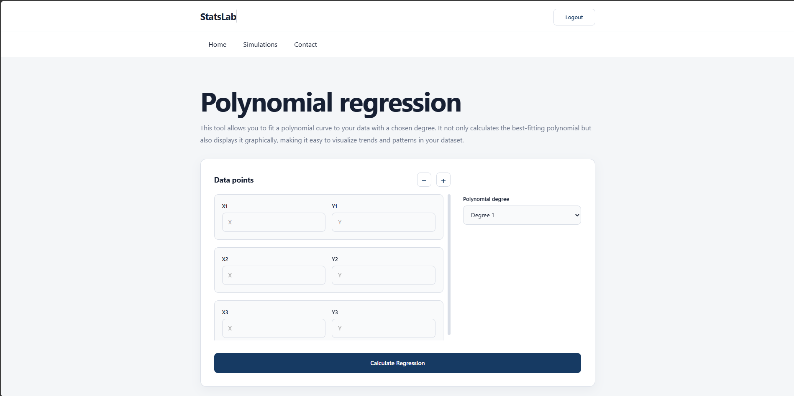
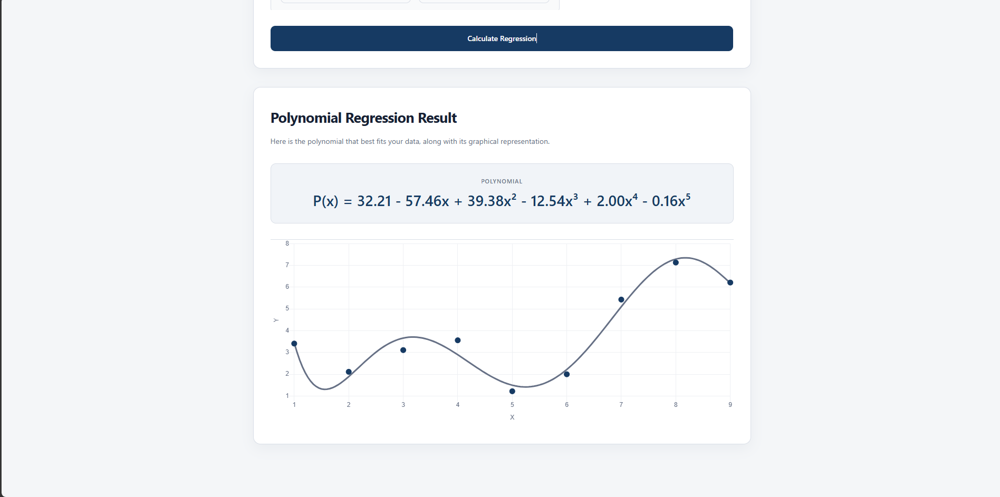

# StatsLab

Statistical simulation platform built from scratch.

## About

**Description** : A real-time, full-stack statistical simulator built to bridge education and research.

The objective of the project is to serve students and scientists:

➤ **For Students**: Master complex statistical principles through interactive animations.

➤ **For Scientists**: Generate high-precision data and analysis instantly.

## Features

StatsLab provides a collection of statistical analysis and simulation tools,   featuring interactive charts with dynamic updates (for some features) as parameters are modified.

**Normal Distribution**: calculate probabilities for an interval in a normal distribution given a standard deviation, interval and the mean value.

**Poisson Distribution**: calculate probabilities for discrete events based on a specified average rate of occurrence for an interval.

**Binomial Distribution**: calculate probabilities for a fixed number of independent attempts with configurable success probability.

**Descriptive Statistics**: analyze datasets and delivers statistical measures such as mean, median, variance, standard deviation, and other descriptive metrics.

**Linear Regression**: analyze the relationship between variables using a linear regression model and delivers the correlation, linear equation that best fits the dataset and the chart

**Polynomial Regression**: analyze more complex relationships between variables using polynomial regression with configurable polynomial degree. It delivers the best polynomial that fits your data for the given degree and the chart.

Obs1.: All features were implemented from scratch, which means that the implementations don't rely on high-level libraries. Even the mathematics techniques have been implemented from scratch through Numpy.

Obs2.: The access to the features are followed by a Login, so every user must be logged in. The authentication is done through JWT rotation and cookies.

## Architecture

The project follows the principles of **Clean Architecture**, structured into three main layers:

( * ) **Frameworks & Drivers (External Layer)**: This is where framework-specific and database-related code are place at.

( * ) **Application (Middle Layer)**: Contains the Use Cases, defining the business rules and application logic.

( * ) **Domain (Innermost Layer)**: Holds the Entities, representing the core business models and rules (like the Simpson and OneDimension entity).

In addition to the architectural design, the project combines structured programming in certain parts of the code with OOP in others, integrating both paradigms throughout the system. Regardless of the approach, at least half of the codebase is implemented using asynchronous operations.

## Tech Stack

The main languages used for this project are **Python** and **Java Script**

The stack used for this project is:

( * ) **Numpy**: Used to aid the implementation of mathematical features from scratch.

( * ) **FastAPI**: Used to communicate a client with the statistical features. The API written in FastAPI is the middle term between the statistical features and the API in node.js that will need the results of these features.

( * ) **Express.js**: Used to write a assyncronous API that acts as the middle term between the frontend and the database and the api that calls the features.

( * ) **Node.js**: Used as the main environment in the backend.

( * ) **Redis**: Used to support the implementation of Rate limit in memory-database.

( * ) **MySQL & SQL**: Used as the in-disk database that stores data of the user. SQL was used to fetch user's data and interact with MySQL.

( * ) **HTML & CSS & JavaScript Vanilla**: Used to implement the frontend that consumes the API.

( * ) **Docker**: Used to containerize the application into 5 containers.

( * ) **Nginx**: Used as reverse proxy that acts as an API gateway and load balancer that allows the system to scale to several users.

The stack is connected as follows:

When a web page is requested in the browser, the request is first handled by the Nginx container. The API Gateway in Nginx then routes the request to the frontend, delivering the HTML, CSS, and JavaScript files back to the browser.

Subsequent requests from the browser (permissions or database interactions) are intercepted by Nginx and redirected to the Express.js API running on Node.js. Express.js manages interactions with MySQL and Redis, while also invoking FastAPI endpoints to obtain statistical results.

Finally, FastAPI serves as the bridge to the Domain and Application layers, ensuring that business logic and core rules are properly executed.

Docker distributes the application into 5 main containers

( * ) **Nginx**: container that has port pairing to the host machine. It is reponsible by offering frontend to the clients, implmentation of api gateway and load balance.

( * ) **API in Express**: container that has the part of the backend with the Node.js, database interactions and first layer of endpoints.

( * ) **API in fastapi**: container that has the Python code with the mathematical and statistic implementation with the FastAPI endpoints

( * ) **Redis container**: simple container with implementation of a Redis image

( * ) **MySQL container**: simple container with the implementation of a MySQL image.

**Scalability with Nginx and Docker**: The configuration between Nginx and Docker enables "load balancing" across two Express.js API containers. The requests are distributed using the Round Robin algorithm, ensuring even allocation and improved scalability.

## Screenshots

Screenshot of the login page:

Screenshot of the simulation page

Screenshot of the Poisson Distribution page

Screenshot of the normal distribution page

Screenshot of the polynomial regression page

These are just some of the features.